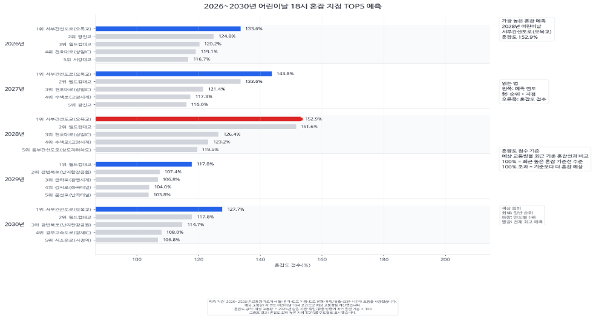
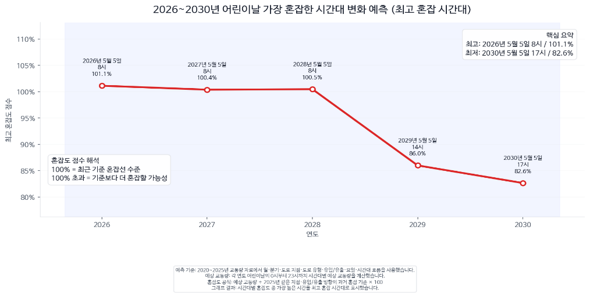
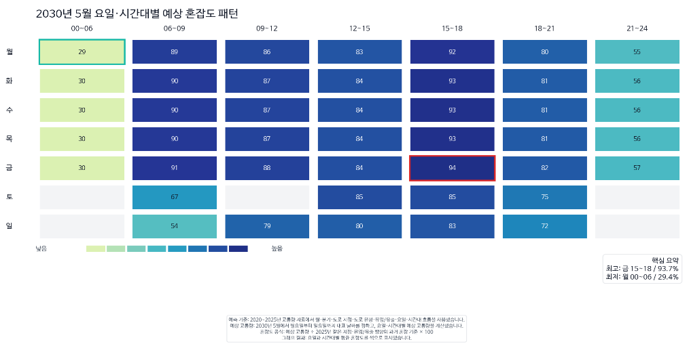
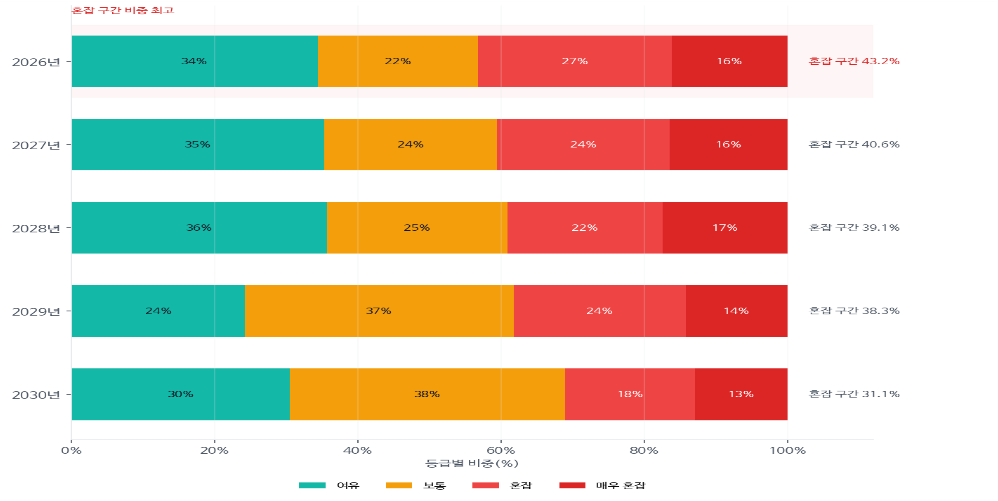

# 서울시 교통량 분석 및 예측
### Seoul Traffic Analysis & Forecasting

Python · pandas · NumPy · Matplotlib · Google Colab

2020~2025년 서울시 교통량 데이터를 분석하고, 연도별 추세를 바탕으로 2026~2030년 교통량을 예측한 5인 팀 프로젝트입니다.  
이 저장소에는 팀 공통 데이터 파이프라인과 팀원별 분석 코드가 들어 있으며, 제가 담당한 ‘특정 날짜의 시간대별 혼잡도 예측’을 중심으로 정리했습니다.

[한국어](#한국어) · [English](#english)

---

# 한국어

## 1. 프로젝트 소개

서울의 교통량은 날짜, 요일, 시간대, 측정 지점에 따라 크게 달라집니다.  
이 프로젝트에서는 서울 열린데이터광장의 2020~2025년 교통량 데이터를 활용해 과거 패턴을 분석하고 2026~2030년의 교통량을 예측했습니다.

### 목표

- 시간대와 요일에 따른 교통량 패턴 분석
- 2026~2030년 교통량 예측
- 분기별·날짜별·지역별 교통량 비교
- 특정 날짜의 시간대별 혼잡도 분석
- 분석 결과를 그래프와 히트맵으로 시각화

---

## 2. 프로젝트 구조

팀원별 분석 코드에서 전처리와 예측 로직을 반복해서 작성하지 않도록, 공통 전처리·예측 파이프라인을 `project_base.py`로 모듈화했습니다.

각 분석 스크립트는 `project_base.py`를 불러와 다음 기능을 공통으로 사용합니다.

- ZIP 파일 탐색 및 압축 해제
- CSV 데이터 로딩
- 교통량 데이터 전처리
- 시간대·요일별 분석 테이블 생성
- 연도별 추세 기반 회귀 모델 학습
- 2026~2030년 예측값 생성
- MAE, R²를 이용한 모델 성능 평가

```text
2020~2025 교통량 데이터
        ↓
CSV 로딩 및 전처리
        ↓
시간대·요일별 분석 테이블 생성
        ↓
연도별 추세 기반 회귀 모델 학습
        ↓
2025년 데이터로 모델 성능 평가
        ↓
2026~2030년 교통량 예측
        ↓
팀원별 분석 및 시각화
```

공통 로직을 한 모듈로 관리하면서 중복 코드를 줄이고, 모든 팀원의 분석에서 같은 전처리 기준과 예측 방식을 사용할 수 있도록 구성했습니다.

---

## 3. 제가 담당한 기능

### 특정 날짜의 시간대별 혼잡도 예측

담당: [강지성 / Jeesung Kahng](https://github.com/diligencefrozen)

`src/specific_day_congestion.py`에서 특정 날짜를 입력받아 시간대별 교통량과 예상 혼잡도를 분석했습니다.

대표 사례로 어린이날(5월 5일)을 사용했습니다. 어린이날은 매년 날짜가 같아 연도별·시간대별 변화를 비교하기 쉽고, 같은 로직을 다른 공휴일이나 원하는 날짜에도 적용할 수 있습니다.

### 구현 내용

- 특정 날짜와 시간대의 2026~2030년 교통량 예측
- 측정 지점·진행 방향별 혼잡도 계산
- 어린이날 오후 6시 예상 혼잡 지점 TOP 5 추출
- 연도별 최고 혼잡 시간대 분석
- 2030년 5월 요일 × 시간대 혼잡도 히트맵 생성
- 2026~2030년 혼잡도 등급 분포 비교

---

## 4. 혼잡도 기준

이 프로젝트의 혼잡도 100%는 도로의 최대 수용량을 의미하지 않습니다.

각 측정 지점과 진행 방향별로 2025년 교통량의 상위 10%가 시작되는 값(90백분위수)을 기준값으로 정하고, 이를 100%로 두었습니다.

예를 들어:

- 100% 초과: 2025년의 높은 교통량 구간보다 더 혼잡할 것으로 예측
- 100% 미만: 해당 기준보다 덜 혼잡할 것으로 예측

즉, 혼잡도는 도로 용량을 나타내는 절대 지표가 아니라 2025년 실측값을 기준으로 만든 상대 지표입니다.

---

## 5. 주요 분석 결과

### 어린이날 오후 6시 예상 혼잡 지점 TOP 5



오목교 구간은 여러 연도에서 반복해서 상위권에 나타났습니다.  
분석 결과 중 가장 높은 혼잡도는 2028년 152.9%로 예측됐습니다.

### 연도별 최고 혼잡 시간대



2026~2028년에는 오전 8시가 가장 혼잡한 시간대로 예측됐습니다.  
2029년부터는 최고 혼잡 시간대가 오후로 이동하는 패턴이 나타났습니다.

### 2030년 5월 요일 × 시간대 예상 혼잡도



오전 시간대도 교통량이 높지만, 오후 3시~6시 구간에서 더 높은 혼잡도가 나타났습니다.  
특히 금요일 오후가 가장 혼잡한 구간으로 예측됐습니다.

### 2026~2030년 혼잡도 등급 분포



연도별로 `원활 / 보통 / 혼잡 / 매우 혼잡` 등급의 비율이 어떻게 변하는지 비교했습니다.

---

## 6. 팀원 및 역할

| 팀원 | GitHub | 담당 |
|---|---|---|
| 엄선필 | [@ESP828](https://github.com/ESP828) | 분기별 평균 교통량 예측 |
| 윤서영 | [@ila98111763-bit](https://github.com/ila98111763-bit) | 날짜별 교통량 TOP 5 / LOW 5 예측 |
| 심승보 | [@ssbgit01](https://github.com/ssbgit01) | 요일별 교통량 예측 |
| 강지성 | [@diligencefrozen](https://github.com/diligencefrozen) | 특정 날짜의 시간대별 혼잡도 예측 |
| 백승재 | [@paikyeon](https://github.com/paikyeon) | 지역별 유입·유출 교통량 예측 |

---

## 7. 기술 스택

| 구분 | 기술 |
|---|---|
| Language | Python |
| Environment | Google Colab, Jupyter Notebook |
| Data Processing | pandas, NumPy |
| Visualization | Matplotlib |
| File Handling | pathlib, glob, zipfile, os |
| Model | 연도별 추세 기반 회귀 |
| Evaluation | MAE, R² |

---

## 8. 저장소 구조

```text
.
├── README.md
├── requirements.txt
├── assets/
│   ├── 01_childrens_day_top5.png
│   ├── 02_peak_hour_change.png
│   ├── 03_weekday_hour_heatmap.png
│   └── 04_congestion_level_distribution.png
├── data/
│   └── README.md
└── src/
    ├── project_base.py
    ├── specific_day_congestion.py
    ├── weekday_forecast.py
    ├── quarterly_forecast.py
    ├── district_flow_forecast.py
    └── daily_top_low_forecast.py
```

### 주요 파일

- `src/project_base.py`  
  공통 데이터 로딩, 전처리, 분석 테이블 생성, 회귀 모델 학습·예측 기능을 담당합니다.

- `src/specific_day_congestion.py`  
  제가 담당한 특정 날짜·시간대별 혼잡도 예측 및 시각화 코드입니다.

- `src/weekday_forecast.py`  
  요일별 교통량 예측 코드입니다.

- `src/quarterly_forecast.py`  
  분기별 평균 교통량 예측 코드입니다.

- `src/district_flow_forecast.py`  
  지역별 유입·유출 교통량 예측 코드입니다.

- `src/daily_top_low_forecast.py`  
  날짜별 교통량 TOP 5 / LOW 5 분석 코드입니다.

- `assets/`  
  README와 발표 자료에 사용한 주요 결과 이미지를 보관합니다.

---

## 9. 실행 방법

이 프로젝트는 Google Colab 환경을 기준으로 개발했습니다.

### 1) 저장소 내려받기

```bash
git clone <repository-url>
cd seoul-traffic-analysis-forecasting
```

### 2) 라이브러리 설치

```bash
pip install -r requirements.txt
```

### 3) 데이터 준비

`data/README.md`를 참고해 다음 정제 데이터를 준비합니다.

```text
seoul_traffic_2020_2025_point_month_weekday_all.csv
seoul_traffic_2020_2025_point_month_hour_all.csv
seoul_traffic_2020_2025_station_master_all.csv
```

기존 Colab 실행 방식에서는 위 파일이 포함된 ZIP 파일을 사용합니다.

### 4) 특정 날짜 혼잡도 분석 실행

```bash
python src/specific_day_congestion.py
```

> 일부 코드는 Google Colab의 `/content` 경로를 기준으로 작성돼 있습니다.  
> 로컬 환경에서 실행하려면 하드코딩된 파일 경로를 설정값이나 실행 인자로 분리하는 작업이 필요합니다.

---

## 10. 한계

이 프로젝트의 2026~2030년 값은 과거 교통량의 연도별 추세를 기반으로 한 예측값입니다.

따라서 다음과 같은 외부 요인은 충분히 반영하지 못했습니다.

- 도로 공사 및 도로망 변경
- 교통 정책 변화
- 대중교통 이용량 변화
- 날씨
- 대형 행사
- 장기적인 인구·도시 구조 변화

또한 혼잡도 100%는 도로 용량이 아니라 2025년 데이터를 기준으로 만든 상대적인 혼잡 지표입니다.

---

## 11. 개선 방향

현재 코드를 포트폴리오 이후 단계까지 발전시킨다면 다음 항목을 우선 개선할 수 있습니다.

- Colab 전용 경로 제거 및 설정 파일 분리
- 데이터 전처리·혼잡도 계산 로직 테스트 코드 추가
- 모델 성능 지표와 예측 결과 자동 저장
- 다른 회귀·시계열 모델과 성능 비교
- 날씨·공휴일·행사·도로 데이터 추가
- CLI 또는 간단한 대시보드 형태로 실행 인터페이스 개선

---

## 12. 데이터 출처

서울 열린데이터광장 — 서울시 교통량 정보  
https://data.seoul.go.kr/dataList/OA-15064/L/1/datasetView.do

프로젝트 기간: 2026년 7월 1일~7월 22일  
프로젝트 형태: 5인 팀 프로젝트 / 데이터 분석 및 예측

---

# English

## 1. About the Project

This five-person team project analyzes Seoul traffic-volume data from 2020–2025 and uses historical trends to forecast traffic for 2026–2030.

The project focuses on how traffic changes by time of day, weekday, quarter, date, and location, then presents those patterns through charts and heatmaps.

### Goals

- Analyze hourly and weekday traffic patterns
- Forecast traffic volume for 2026–2030
- Compare traffic by quarter, date, and district
- Estimate congestion for a selected date and time
- Turn the results into readable charts and heatmaps

---

## 2. Shared Data Pipeline

To keep the team analyses consistent, we moved the shared preprocessing and forecasting logic into `project_base.py`.

Each analysis script imports the same module for:

- ZIP discovery and extraction
- CSV loading
- Data preprocessing
- Hourly and weekday analysis tables
- Trend-based regression training
- 2026–2030 forecast generation
- Model evaluation with MAE and R²

```text
2020–2025 traffic data
        ↓
Load and preprocess CSV files
        ↓
Build hourly and weekday analysis tables
        ↓
Train trend-based regression models
        ↓
Validate against 2025 observations
        ↓
Generate 2026–2030 forecasts
        ↓
Run team-specific analyses and visualizations
```

This structure reduces duplicated code and keeps the preprocessing and forecasting rules consistent across the team's scripts.

---

## 3. My Contribution

### Selected-Date Congestion Forecasting

Owner: [Jeesung Kahng](https://github.com/diligencefrozen)

My work is in `src/specific_day_congestion.py`. It forecasts traffic for a selected date and breaks the results down by time of day and location.

I used Children's Day (May 5) as the main case study. Because the date is fixed each year, it provides a clean way to compare traffic patterns across multiple years. The same workflow can also be applied to other holidays or user-selected dates.

### What I Implemented

- Forecast traffic volume for a selected date and hour from 2026–2030
- Calculate congestion scores by counting point and direction
- Rank the Top 5 expected congestion locations at 6:00 PM on Children's Day
- Identify the predicted peak hour for each year
- Generate a weekday × hour congestion heatmap for May 2030
- Compare congestion-level distributions from 2026–2030

---

## 4. Congestion Score

A congestion score of 100% does not represent the physical capacity of a road.

For each counting point and direction, the project uses the 90th percentile of 2025 traffic volume as the 100% reference level.

That means:

- Above 100%: predicted to be busier than the high-traffic range observed in 2025
- Below 100%: predicted to be below that reference level

The score is a relative benchmark against 2025 observations, not a road-capacity metric.

---

## 5. Key Results

### Children's Day at 6:00 PM — Top 5 Expected Congestion Locations


The Omokgyo section appeared repeatedly near the top across multiple forecast years.  
The highest congestion score in this analysis was 152.9% for 2028.

### Predicted Peak Hour by Year


The model placed the peak at 8:00 AM from 2026 through 2028.  
Starting in 2029, the predicted peak shifted into the afternoon.

### Weekday × Hour Congestion — May 2030


Traffic remained elevated in the morning, but the stronger congestion pattern appeared between 3:00 PM and 6:00 PM.  
Friday afternoon was the busiest period in this analysis.

### Congestion-Level Distribution — 2026–2030


This view compares how the share of `Free / Normal / Congested / Very Congested` conditions changes by year.

---

## 6. Team

| Team Member | GitHub | Responsibility |
|---|---|---|
| Sunpil Eom | [@ESP828](https://github.com/ESP828) | Quarterly average traffic forecasting |
| Seoyoung Yoon | [@ila98111763-bit](https://github.com/ila98111763-bit) | Daily Top 5 / Low 5 traffic forecasting |
| Seungbo Sim | [@ssbgit01](https://github.com/ssbgit01) | Weekday traffic forecasting |
| Jeesung Kahng | [@diligencefrozen](https://github.com/diligencefrozen) | Selected-date congestion forecasting by time of day |
| Seungjae Baek | [@paikyeon](https://github.com/paikyeon) | District inflow/outflow traffic forecasting |

---

## 7. Tech Stack

| Area | Tools |
|---|---|
| Language | Python |
| Environment | Google Colab, Jupyter Notebook |
| Data Processing | pandas, NumPy |
| Visualization | Matplotlib |
| File Handling | pathlib, glob, zipfile, os |
| Model | Trend-based regression |
| Evaluation | MAE, R² |

---

## 8. Repository Structure

```text
.
├── README.md
├── requirements.txt
├── assets/
│   ├── 01_childrens_day_top5.png
│   ├── 02_peak_hour_change.png
│   ├── 03_weekday_hour_heatmap.png
│   └── 04_congestion_level_distribution.png
├── data/
│   └── README.md
└── src/
    ├── project_base.py
    ├── specific_day_congestion.py
    ├── weekday_forecast.py
    ├── quarterly_forecast.py
    ├── district_flow_forecast.py
    └── daily_top_low_forecast.py
```

### Key Files

- `src/project_base.py`  
  Shared data loading, preprocessing, analysis-table construction, regression training, and forecasting.

- `src/specific_day_congestion.py`  
  My selected-date congestion forecasting and visualization workflow.

- `src/weekday_forecast.py`  
  Weekday traffic forecasting.

- `src/quarterly_forecast.py`  
  Quarterly average traffic forecasting.

- `src/district_flow_forecast.py`  
  District inflow/outflow traffic forecasting.

- `src/daily_top_low_forecast.py`  
  Daily Top 5 / Low 5 traffic analysis.

- `assets/`  
  Main charts used in the README and presentation.

---

## 9. Running the Project

The original workflow was developed for Google Colab.

### 1) Clone the repository

```bash
git clone <repository-url>
cd seoul-traffic-analysis-forecasting
```

### 2) Install dependencies

```bash
pip install -r requirements.txt
```

### 3) Prepare the data

See `data/README.md` and prepare:

```text
seoul_traffic_2020_2025_point_month_weekday_all.csv
seoul_traffic_2020_2025_point_month_hour_all.csv
seoul_traffic_2020_2025_station_master_all.csv
```

The original Colab workflow expects these cleaned files to be provided through a ZIP archive.

### 4) Run my analysis

```bash
python src/specific_day_congestion.py
```

> Some scripts still rely on Colab's `/content` path.  
> Running the project locally requires moving those hard-coded paths into configuration or command-line arguments.

---

## 10. Limitations

The 2026–2030 outputs are forecasts based on historical year-over-year trends.

The current model does not fully account for:

- Road construction or network changes
- Transportation policy changes
- Changes in public-transit usage
- Weather
- Major events
- Long-term demographic or urban-structure changes

The 100% congestion score is also a relative benchmark against 2025 traffic, not a measure of road capacity.

---

## 11. Next Steps

Potential improvements include:

- Remove Colab-specific paths and introduce configuration
- Add tests for preprocessing and congestion-scoring logic
- Save model metrics and forecast outputs automatically
- Compare the current approach with other regression and time-series models
- Add weather, holiday, event, and road-network features
- Package the workflow behind a CLI or lightweight dashboard

---

## 12. Data Source

Seoul Open Data Plaza — Seoul Traffic Volume Information  
https://data.seoul.go.kr/dataList/OA-15064/L/1/datasetView.do

Project period: July 1–22, 2026  
Project type: Five-person team project / data analysis and forecasting
